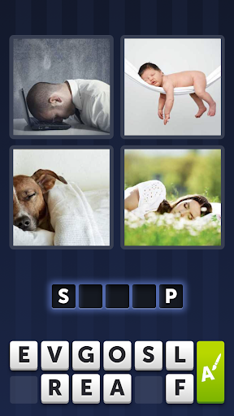

# 🚀 WeWard Front-End Challenge

## Objectif

Sur la base du célèbre jeu "4 images 1 mot", vous devez tenter de reproduire le fonctionnement de ce jeu.

## Énoncé

Votre objectif est d'initier un projet Expo avec React Native pour reproduire le fonctionnement du jeu "4 images 1 mot".
Implémentez une API permettant d'obtenir 1 mot et 4 images liées à ce mot. L'utilisateur doit deviner le mot en choisissant les lettres disponibles.
Lorsque le mot est correct, les lettres deviennent vertes. Sinon, elles deviennent rouges.
Le jeu n'a pas de fin mais les points et les parties ne sont pas nécessairement comptabilisés.
Les lettres disponibles sont affichées en 2 rangées de 6 lettres.

### Rappels de fonctionnement
* L'utilisateur doit deviner le mot qui correspond aux 4 images affichées.
* L'utilisateur doit saisir sa réponse en choisissant les lettres disponibles parmi les 12 lettres affichées en 2 rangées de 6.
* Une lettre ne peut être utilisée qu'une seule fois. Lorsqu'une lettre est utilisée, elle doit être désactivée.
* Pour retirer une lettre de la réponse, l'utilisateur doit toucher cette lettre.
* Le bouton vert à droite des lettres disponibles doit permettre d'effacer la réponse.

### Contraintes
* Votre projet doit être fonctionnel avec [Expo Go](https://expo.dev/go)
* Essayez de reproduire cette UI le plus fidèlement possible.
* Vous devez installer le moins de dépendances/librairies possibles.
* Votre application ne doit contenir qu'un seul écran.

### Astuces
* Voici une API permettant d'obtenir un mot [Rando](https://random-word-api.vercel.app/)
* Voici une API permettant d'obtenir les images pour un mot donné [Pexels](https://www.pexels.com/api/)

## Installation

Suivez le Get Started de la documentation d'Expo pour initialiser votre projet.

https://docs.expo.dev/get-started/create-a-project/

## Submission

* Téléchargez votre projet sur un repository public et partagez-nous le lien.
